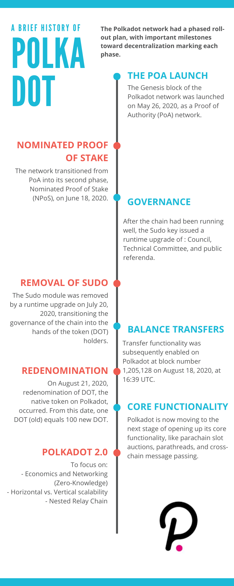

The Polkadot network had a phased roll-out plan, with important milestones toward decentralization
marking each phase.

## The PoA Launch

The Genesis block of the Polkadot network was launched on May 26, 2020, as a Proof of Authority
(PoA) network. Governance was restricted to the single Sudo (super-user) key, which was held by Web3
Foundation to issue the commands and upgrades necessary to complete the launch process. During this
time, validators started joining the network and signaling their intention to participate in
consensus.

## Nominated Proof of Stake

Once Web3 Foundation was confident in the stability of the network and there was a sufficient number
of validator intentions, Web3 Foundation used [Sudo](https://youtu.be/InekMjJpVdo) &mdash; a
superuser account with access to governance functions &mdash; to initiate the first validator
election. Following this election, the network transitioned from PoA into its second phase,
[Nominated Proof of Stake (NPoS)](learn-staking), on June 18, 2020.

## Governance

After the chain had been running well with the validator set, the Sudo key issued a runtime upgrade
that enabled the suite of governance modules in Polkadot; namely, the modules to enable a
[Council](learn-governance#council), a [Technical Committee](learn-governance#technical-committee),
and [public referenda](learn-governance#public-referenda).

## Removal of Sudo

The Sudo module was removed by a runtime upgrade on July 20, 2020, transitioning the
[governance](learn-governance) of the chain into the hands of the token (DOT) holders.

From this point, the network has been entirely in the hands of the token holders and is no longer
under control of any centralized authority.

## Balance Transfers

To enable balance transfers, the community [made a public proposal](maintain-guides-democracy) for a
runtime upgrade that lifted the restriction on balance transfers. Transfer functionality was
subsequently enabled on Polkadot at block number 1,205,128 on August 18, 2020, at 16:39 UTC.

## Redenomination

On August 21, 2020, [redenomination](redenomination) of DOT, the native token on Polkadot, occurred.
From this date, one DOT (old) equals 100 new DOT.

## Core Functionality

Polkadot is now moving to the next stage of opening up its core functionality, like parachain slot
auctions, parathreads, and cross-chain message passing. These upgrades will require runtime upgrades
that will pass through Polkadot's normal governance processes. The core functionality does not have
to be unlocked sequentially &mdash; several features can be unlocked with a single proposal.

Parachains will first roll out on Kusama with a common good parachain, followed by the first slot
auction and winner's onboarding. Once those parachains are working well on Kusama, the first common
good parachain will launch, and then the first slot auction will take place on Polkadot.

## Polkadot 2.0

With the release of Polkadot 1.0, researchers have begun research for the next version of the
Polkadot network. With many questions yet to be answered, as of now, some big areas of research will
be in:

- Economics and Networking (Zero-Knowledge): How will scalability work in Polkadot 2.0?
- Horizontal vs. Vertical scalability: What is the breaking point of the maximum number of
  parachains built with horizontal scalability?
- Nested Relay Chain: How can multiple Relay Chains exist connected through parachains? How many
  tiers of Relay Chains can be nested? How will validators work together to validate blocks on
  various Relay Chains? How is [XCMP](learn-crosschain) working in the nested setup? How is
  [AnV](learn-availability) going to work there?
  
## Polkadot Launch Phases

